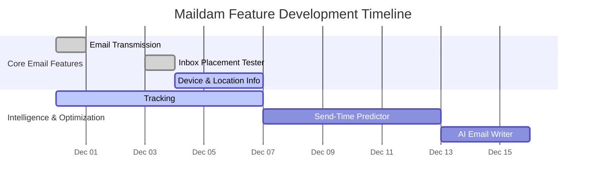
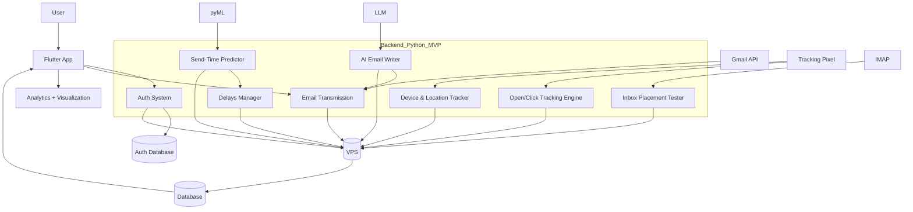

# Maildam Project Diagrams

## Gantt Chart

```mermaid

gantt
    title Maildam Feature Development Timeline
    dateFormat YYYY-MM-DD
    axisFormat  %b %d
    
    section Core Email Features
    Email Transmission           :done, email, 2025-11-30, 1d
    Inbox Placement Tester :done, inbox, 2025-12-03, 1d
    Device & Location Info :active,device, 2025-12-04, 2025-12-07
    
    section Intelligence & Optimization
    Tracking             :active, track, 2025-11-30, 2025-12-07
    Send-Time Predictor  :predict, after device, 2025-12-13
    AI Email Writer      :ai, after predict, 2025-12-16

```

```mermaid

flowchart TD

A[User] --> B[Flutter App]

B --> C[Auth System]
C --> DBA[(Auth Database)]

B --> D[Email Transmission]
E[Gmail API] --> D

B --> G[Analytics + Visualization]

N[Tracking Pixel] --> H[Open/Click Tracking Engine]
O[IMAP] --> I[Inbox Placement Tester]
P[pyML] --> J[Send-Time Predictor]
J --> K[Delays Manager]
N --> L[Device & Location Tracker]

VPS --> DB[(Database)]

DB --> B

Q[LLM] --> M[AI Email Writer]
M --> D

C --> VPS[(VPS)]
D --> VPS
H --> VPS
I --> VPS
J --> VPS
K --> VPS
L --> VPS
M --> VPS

subgraph Backend_Python_MVP
    C
    D
    H
    I
    J
    K
    L
    M
end

```